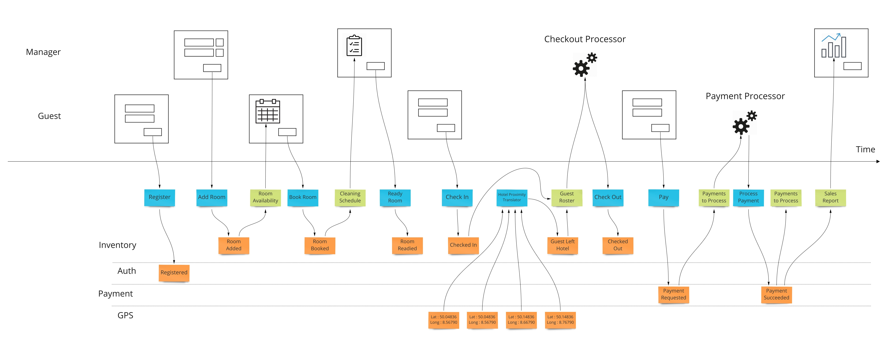

# Event Model

A small DSL and SVG renderer for [Event Modeling](https://eventmodeling.org) diagrams. You describe a system as a sequence of UIs, commands, domain events, read models, and automations; the renderer lays it out as a strict horizontal timeline with swimlanes — actors on top, aggregates on the bottom, commands and read models on the central time axis — so every element in the same causal step lines up vertically across all lanes.



## Running the example

The demo is a single HTML page with no build step. d3 is loaded from a CDN at runtime.

```sh
# from the repo root
python3 -m http.server 8000
```

Then open <http://localhost:8000/event-model.html>.

A local HTTP server is recommended because `event-model.js` is an ES module and some browsers block module imports over `file://`. If yours doesn't, double-clicking `event-model.html` also works.

Edit the DSL in the textarea and click **Render**. The diagram scrolls horizontally — each element gets its own column, so wide models overflow the right edge rather than compressing.

## The DSL

See [`blueprint_dsl`](blueprint_dsl) for a full example (a hotel booking system). The grammar:

```
eventModel
    actor <Name>
    aggregate <Name>

    ui:<Actor>         <id>["Label"]
    command            <id>["Label"]
    domainEvent:<Agg>  <id>["Label"]
    readModel          <id>["Label"]
    automation:<Actor> <id>["Label"]

    <id> --> <id>
```

- **actor** — declares a top swimlane (e.g. `Manager`, `Guest`).
- **aggregate** — declares a bottom swimlane representing a bounded context (e.g. `Inventory`, `Payment`).
- **ui** — a screen owned by an actor; placed in that actor's lane.
- **command** — an intent issued from a UI or automation; placed in the Time lane.
- **domainEvent** — a fact emitted by an aggregate; placed in that aggregate's lane.
- **readModel** — a projection read by UIs or automations; placed in the Time lane.
- **automation** — an automated process owned by an actor; placed in that actor's lane.
- **-->** — a flow edge. The canonical pattern is `ui → command → domainEvent → readModel → (ui | automation)`.

Labels are optional; if omitted, the identifier is used as the label.

## How layout works

The renderer (`event-model.js`) has three stages:

1. **Parse** — `parseEventModel(src)` reads the DSL into `{ actors, aggregates, elements, edges }`.
2. **Rank** — `computeRanks` runs a DFS to identify back-edges (so cycles like `paymentSucceeded ↔ paymentsToProcess` don't blow up), then performs Kahn's topological sort of the forward DAG with declaration order as the tiebreaker. Each element gets a unique column — no two elements share an x-position, even across lanes.
3. **Layout + draw** — `layoutEventModel` places each element at `(column × colWidth, lane.y)`; `renderEventModel(src, target)` uses d3 data joins to draw lane bands, a dashed time axis, edges (as `d3.linkHorizontal` beziers), and the nodes with kind-specific styles.

Because columns are a true topological order, the horizontal position of any node is its earliest possible time given the causal edges you declared — the core property an Event Model needs.

## Files

- `event-model.html` — standalone demo page.
- `event-model.js` — ES module with `parseEventModel`, `computeRanks`, `layoutEventModel`, and `renderEventModel`. Imports d3 v7 from jsDelivr.
- `blueprint_dsl` — reference DSL source used as the default in the demo.
- `blueprint_model_only.jpeg`, `blueprint_large.jpg` — the target visuals the renderer approximates.
